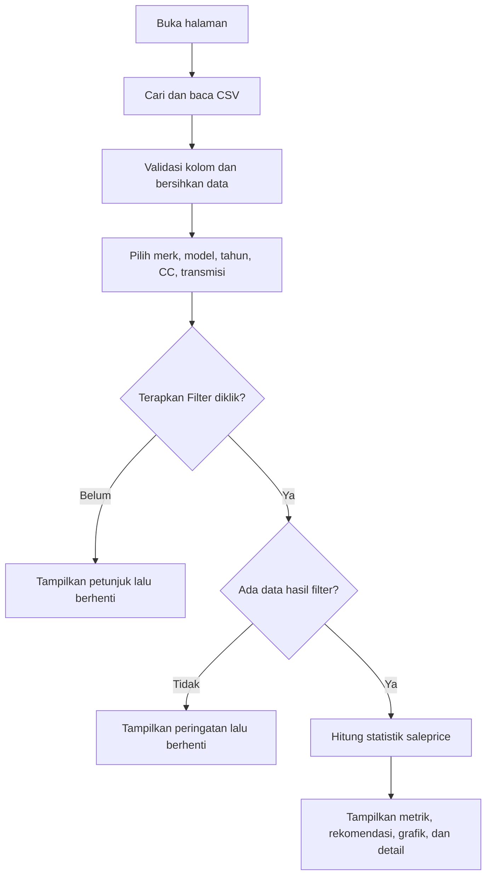

# Dokumentasi Engine Lelang

## 1. Tujuan dan ruang lingkup

[`pages/engine_lelang.py`](../pages/engine_lelang.py) adalah halaman Streamlit untuk menganalisis histori harga transaksi lelang kendaraan dari `Lelang_Live.csv`. Pengguna memilih parameter kendaraan, kemudian aplikasi menampilkan statistik harga, indikasi harga dasar lelang, grafik, dan detail transaksi pembanding (*comparable*).

Indikasi harga dasar menggunakan **median `saleprice` dari data yang lolos filter**. Implementasi ini merupakan prototype statistik satu sumber data, belum menggunakan model machine learning atau penyesuaian kondisi kendaraan.

Dokumentasi ini disusun berdasarkan pembacaan kode sumber, tanpa menjalankan aplikasi atau memvalidasi isi dataset aktual.

## 2. Struktur dan dependensi

```text
Dashboard_EngineOTR/
├── home.py
├── requirements.txt
├── Lelang_Live.csv           # Lokasi alternatif sumber data
├── pages/
│   ├── engine_lelang.py
│   └── Lelang_Live.csv       # Diprioritaskan jika tersedia
└── docs/
    └── engine_lelang.md
```

Struktur di atas menggambarkan lokasi yang didukung; file CSV tidak harus tersedia di kedua lokasi.

| Dependensi | Penggunaan |
|---|---|
| `pathlib.Path` | Menentukan lokasi script dan mencari file CSV. |
| `csv` | Memecah header dan setiap baris CSV. |
| `pandas` | Membersihkan, memfilter, menghitung statistik, dan menyiapkan tabel. |
| `plotly.express` | Membuat grafik batang Q1, median, dan Q3. |
| `streamlit` | Menampilkan antarmuka, cache, pesan, dan hasil analisis. |

`pathlib` dan `csv` merupakan modul bawaan Python. `requirements.txt` proyek mencantumkan `streamlit>=1.39`, `pandas>=2.0`, `numpy>=1.24`, dan `plotly>=5.20`. Script ini tidak mengimpor NumPy secara langsung.

## 3. Sumber data dan kontrak kolom

### Lokasi file

Script mencari `Lelang_Live.csv` sesuai urutan berikut:

1. Direktori script: `pages/Lelang_Live.csv`.
2. Direktori induk: `Lelang_Live.csv` pada root proyek.

Jika kedua file tersedia, file di `pages/` digunakan. Jika tidak ada, proses pembacaan menghasilkan pesan kesalahan dan halaman berhenti.

### Kolom wajib

| Kolom | Tipe setelah pemrosesan | Fungsi |
|---|---|---|
| `Brand_Norm` | String | Filter merk. |
| `Model_Norm` | String | Filter model. |
| `Type_Norm` | String | Sumber pilihan dan filter tipe. |
| `Tipe` | String | Identitas tipe kendaraan; record kosong dikeluarkan. |
| `Tahun` | Numerik | Filter tahun kendaraan. |
| `CC_Norm` | Numerik | Filter kapasitas mesin. |
| `Transmission_Norm` | String | Filter transmisi. |
| `saleprice` | Numerik positif | Sumber seluruh perhitungan harga. |

Nama kolom bersifat peka huruf besar/kecil. Spasi di awal dan akhir nama kolom dibuang sebelum validasi.

**Satuan kapasitas mesin:** antarmuka memberi akhiran `L` pada nilai `CC_Norm`, tanpa melakukan konversi. Agar tampilan benar, sumber data perlu menggunakan nilai dalam liter, misalnya `1.5`. Nilai `1500` akan ditampilkan sebagai `1500 L`.

### Kolom opsional

| Kelompok | Kolom |
|---|---|
| Detail transaksi yang dapat ditampilkan | `SaleDate`, `kilometer1`, `grade_overrall_csis`, `BalaiLelang`, `lokasi` |
| Teks tambahan yang dibersihkan bila tersedia | `Merk`, `ModelName`, `Warna`, `KodeDaerah`, `Transmisi`, `kilometer2`, `note_csis`, `main_type_Norm`, `type_tags_Norm` |
| Angka tambahan yang dikonversi bila tersedia | `Year`, `cc`, `lelang_price` |

Kolom teks pada detail juga dibersihkan. `kilometer1` dikonversi menjadi angka dan `SaleDate` menjadi tanggal. `Year` tidak menggantikan kewajiban adanya `Tahun`; `lelang_price` tidak menggantikan `saleprice` sebagai sumber harga.

### Contoh CSV minimal

Contoh sintetis dengan nilai kapasitas mesin dalam liter dan harga dalam rupiah:

```csv
Brand_Norm,Model_Norm,Type_Norm,Tipe,Tahun,CC_Norm,Transmission_Norm,saleprice
toyota,avanza,g,1.5 G,2020,1.5,at,150000000
toyota,avanza,g,1.5 G,2020,1.5,at,160000000
toyota,avanza,g,1.5 G,2020,1.5,at,170000000
```

## 4. Pembacaan dan pembersihan data

### Parsing CSV khusus

`read_lelang_live_csv(file_path)` membaca file dengan encoding `utf-8-sig` untuk menangani BOM. Karakter yang tidak dapat didekode diganti melalui `errors="replace"`.

Urutan pemrosesan:

1. Baca baris pertama sebagai header menggunakan `csv.reader`.
2. Tentukan jumlah kolom yang diharapkan dari header.
3. Baca setiap baris fisik berikutnya dan abaikan baris kosong.
4. Jika baris diawali dan diakhiri tanda kutip ganda, lepaskan kutip terluar lalu ubah `""` menjadi `"`.
5. Parse baris menggunakan `csv.reader`.
6. Lewati baris yang menghasilkan `csv.Error` atau memiliki jumlah kolom berbeda dari header.
7. Kembalikan DataFrame serta jumlah baris yang dilewati (`skipped_rows`).

Penanganan kutip terluar ditujukan untuk format sumber yang membungkus satu record penuh dalam tanda kutip, termasuk ketika kolom seperti `note_csis` berisi koma dan kutip. Loader bekerja per baris fisik sehingga tidak mendukung record dengan isi kolom yang membentang beberapa baris. Heuristik kutip terluar juga perlu diperiksa jika format ekspor CSV berubah.

### Normalisasi dalam `load_data()`

1. Bersihkan spasi pada nama kolom.
2. Pastikan semua kolom wajib tersedia.
3. Bersihkan spasi awal/akhir kolom teks yang dikenal; string kosong menjadi `pd.NA`.
4. Konversi kolom angka menggunakan `pd.to_numeric(..., errors="coerce")`; nilai yang gagal dikonversi menjadi nilai kosong numerik.
5. Konversi `SaleDate`, jika tersedia, menggunakan `pd.to_datetime(..., errors="coerce")`.
6. Pertahankan hanya record dengan `Brand_Norm`, `Model_Norm`, dan `Tipe` tidak kosong, serta `saleprice` lebih besar dari nol.

Nilai angka sebaiknya tidak mengandung awalan `Rp` atau pemisah ribuan lokal karena script tidak membersihkan format tersebut sebelum konversi.

`skipped_rows` hanya menghitung kegagalan parsing atau ketidaksesuaian jumlah kolom. Record yang dibuang karena brand/model/tipe kosong, harga tidak valid, dan baris kosong tidak masuk hitungan ini.

`load_data()` menggunakan `@st.cache_data(show_spinner=False)`. Fungsi tidak menerima parameter waktu perubahan file dan tidak menetapkan TTL; pembaruan isi CSV tidak secara eksplisit menjadi pemicu pembatalan cache. Jika data yang tampil masih lama setelah CSV diganti, bersihkan cache Streamlit dan jalankan ulang halaman.

## 5. Alur penggunaan



Filter bersifat bertingkat:

| Urutan | Filter | Opsi berasal dari |
|---|---|---|
| 1 | Merk | Seluruh data dengan harga valid. |
| 2 | Model | Hasil filter merk. |
| 3 | Tipe | Hasil filter merk dan model, dari kolom `Type_Norm`. |
| 4 | Tahun | Hasil filter merk, model, dan tipe; opsi tahun hanya 1900–2100, diurutkan menurun. |
| 5 | CC | Hasil empat filter sebelumnya; nilai tidak kosong, diurutkan menaik. |
| 6 | Transmisi | Hasil lima filter sebelumnya. |

Setiap filter memiliki pilihan `Semua ...` untuk melewati penyaringan pada parameter tersebut. Opsi tahun dibatasi 1900–2100, tetapi record di luar rentang itu tidak otomatis dibuang ketika `Semua Tahun` dipilih.

Pilihan filter langsung membentuk DataFrame hasil pada setiap eksekusi halaman. Tombol **Terapkan Filter** mengizinkan penayangan hasil analisis. Karena tombol tidak berada dalam `st.form` dan hasil tidak disimpan secara eksplisit dalam `st.session_state`, perubahan widget berikutnya membuat halaman kembali meminta klik tombol untuk menampilkan hasil.

Pencocokan filter memakai kesamaan nilai persis. Tampilan merk/model/tipe/transmisi menggunakan title case, tetapi nilai sumber tidak diubah menjadi huruf kecil atau digabungkan berdasarkan kesamaan ejaan.

## 6. Perhitungan dan hasil

Misalkan `P` adalah seluruh nilai `saleprice > 0` dari record yang lolos filter.

| Hasil | Implementasi |
|---|---|
| Jumlah Data Comparable | `len(P)`; jumlah record, bukan jumlah kendaraan unik. |
| Median Harga Lelang | `P.median()` |
| Rata-rata Harga Lelang | `P.mean()` |
| Q1 | `P.quantile(0.25)` |
| Q3 | `P.quantile(0.75)` |
| Harga minimum / maksimum | `P.min()` / `P.max()` |
| Indikasi harga dasar lelang | `suggested_floor = P.median()` |

Rentang Q1–Q3 menggambarkan bagian tengah distribusi harga. Perhitungan kuantil menggunakan perilaku bawaan Pandas; script tidak menetapkan metode interpolasi khusus.

Untuk contoh sintetis Rp150 juta, Rp160 juta, dan Rp170 juta:

- Jumlah comparable: 3 record.
- Median dan rata-rata: Rp160 juta.
- Q1: Rp155 juta; Q3: Rp165 juta.
- Minimum–maksimum: Rp150 juta–Rp170 juta.
- Indikasi harga dasar: Rp160 juta.

### Komponen keluaran

1. **Informasi sumber:** nama file dan jumlah record dengan harga valid sebelum filter kendaraan.
2. **Peringatan parsing:** jumlah baris yang gagal dibaca, jika ada.
3. **Empat metrik:** jumlah comparable, median, rata-rata, dan rentang Q1–Q3.
4. **Prototype rekomendasi:** median serta keterangan rentang minimum–maksimum.
5. **Grafik batang:** tiga batang untuk Q1, median, dan Q3; bukan histogram transaksi.
6. **Grafik rata-rata per grade:** rata-rata `saleprice` untuk grade `GOOD`, `VERY_GOOD`, dan `BAD`. Tooltip setiap batang memuat jumlah data dan satu contoh `note_csis` yang tidak kosong untuk grade tersebut.
7. **Tabel detail:** record hasil filter dengan kolom yang tersedia.

| Kolom sumber | Label pada tabel |
|---|---|
| `Brand_Norm` | Merk |
| `Model_Norm` + `main_type_Norm` | Tipe (gabungan kedua nilai, dipisahkan satu spasi) |
| `Tahun` | Tahun |
| `CC_Norm` | CC |
| `Transmission_Norm` | Transmisi |
| `saleprice` | Harga Lelang |
| `SaleDate` | Tanggal Lelang |
| `kilometer1` | Kilometer |
| `grade_overrall_csis` | Grade |
| `BalaiLelang` | Balai Lelang |
| `lokasi` | Lokasi |

Pemformatan dilakukan pada salinan `filtered`, sehingga nilai numerik untuk analisis tetap tersedia. Harga tabel memakai satuan ringkas, tanggal memakai `YYYY-MM-DD`, kapasitas memakai akhiran `L`, dan kilometer memakai pemisah ribuan titik. Tidak ada ekspor file atau penulisan kembali ke CSV yang diimplementasikan secara eksplisit dalam script.

## 7. Referensi fungsi

| Fungsi | Input | Output / tanggung jawab |
|---|---|---|
| `read_lelang_live_csv(file_path)` | Path CSV | Tuple `(DataFrame, skipped_rows)` hasil parsing khusus. |
| `load_data()` | Tidak ada; membaca `DATA_FILE` global | Tuple data bersih dengan harga valid dan jumlah baris gagal parsing; hasil di-cache. |
| `compact_money(value)` | Angka atau nilai kosong | Teks ringkas memakai `rb`, `jt`, `milyar`, atau `triliun`; nilai kosong menjadi `-`. |
| `full_money(value)` | Angka atau nilai kosong | Rupiah penuh tanpa desimal, misalnya `Rp 150.000.000`; nilai kosong menjadi `-`. |
| `sorted_text(series)` | Series | Nilai unik tidak kosong, dibersihkan dari spasi lalu diurutkan tanpa membedakan kapital saat pengurutan. |
| `valid_years(dataframe)` | DataFrame | Daftar tahun 1900–2100, dikonversi ke integer, unik, urutan menurun. |
| `cc_label(value)` | Nilai CC atau `Semua CC` | Label angka dengan akhiran `L`, atau label semua CC. |
| `title_label(value)` | Nilai opsi filter | Title case, kecuali label berawalan `Semua `. |
| `vehicle_filter_panel(dataframe)` | DataFrame bersih | Menampilkan widget dan mengembalikan `(filtered, submitted)`. |

Bagian setelah definisi fungsi dijalankan langsung sebagai halaman Streamlit: memuat data, menampilkan header, memproses filter, menghitung statistik, lalu merender hasil.

## 8. Menjalankan aplikasi

Dari root proyek, dengan lingkungan Python yang sudah disiapkan:

```bash
python -m pip install -r requirements.txt
python -m streamlit run home.py
```

Buka halaman Engine Lelang melalui navigasi aplikasi. Untuk menjalankan halaman ini secara langsung:

```bash
python -m streamlit run pages/engine_lelang.py
```

Pastikan CSV tersedia pada salah satu lokasi yang didukung dan memiliki enam kolom wajib. Pilih parameter kendaraan, klik **Terapkan Filter**, lalu baca ringkasan dan detail comparable.

## 9. Penanganan masalah

| Kondisi | Perilaku / pemeriksaan |
|---|---|
| File tidak ditemukan | `FileNotFoundError` ditampilkan melalui `st.error`; periksa lokasi CSV. |
| Baris header kosong | `ValueError` dengan pesan file kosong; pastikan baris pertama berisi header. |
| Kolom wajib hilang | Pesan mencantumkan kolom yang hilang dan kolom tersedia; periksa ejaan serta kapitalisasi. |
| Baris CSV rusak | Baris dilewati dan jumlahnya ditampilkan sebagai peringatan; periksa delimiter, kutip, dan jumlah field. |
| Tombol belum diklik | Halaman menampilkan petunjuk pemilihan parameter dan menghentikan eksekusi sebelum analisis. |
| Hasil filter kosong | Halaman menampilkan peringatan; perluas pilihan filter atau periksa nilai data. |
| Harga tidak tersedia | Ada pemeriksaan tambahan terhadap kumpulan harga sebelum statistik; halaman berhenti jika kosong. |
| Data tidak berubah setelah CSV diperbarui | Bersihkan cache Streamlit lalu jalankan ulang halaman. |
| Nilai kapasitas tampil terlalu besar | Periksa satuan `CC_Norm`; kode menambahkan `L` tanpa konversi. |

Blok `try/except` menangani kesalahan saat `load_data()` dipanggil. Kesalahan setelah tahap pemuatan tidak tercakup dalam blok tersebut.

## 10. Batasan implementasi

- Comparable hanya ditentukan oleh merk, model, tahun, kapasitas mesin, dan transmisi yang dipilih. Opsi `Semua ...` dapat menghasilkan kelompok yang sangat luas.
- Kilometer, grade, tanggal transaksi, tipe kendaraan, lokasi, dan balai lelang belum memengaruhi rekomendasi harga.
- Tidak ada batas minimal jumlah comparable, penghapusan duplikat, penanganan outlier, pembobotan transaksi terbaru, atau interval kepercayaan.
- Kolom berakhiran `_Norm` diasumsikan telah dinormalisasi oleh proses sebelumnya; script hanya membersihkan spasi dan melakukan konversi tipe tertentu.
- Nilai tahun tidak divalidasi sebagai bilangan bulat sebelum pembuatan opsi; data tahun sebaiknya sudah berupa tahun bulat.
- Seluruh record yang lolos parsing dikumpulkan di memori sebelum menjadi DataFrame; tidak ada pemrosesan bertahap untuk dataset besar.
- Hasil rekomendasi merupakan median histori kelompok terpilih, bukan jaminan harga transaksi berikutnya.

## 11. Titik perubahan untuk pemeliharaan

| Kebutuhan | Bagian yang perlu ditinjau |
|---|---|
| Mengubah lokasi/nama sumber data | `DATA_CANDIDATES` dan pesan loader. |
| Mengubah pemetaan kolom kendaraan | `FILTER_COLUMNS`, daftar normalisasi, serta pemetaan kolom detail. |
| Mengubah sumber harga | `PRICE_COLUMN`, daftar konversi numerik, teks rekomendasi, dan kolom detail yang masih menyebut `saleprice`. |
| Menambah parameter pembanding | `vehicle_filter_panel()` serta validasi/pembersihan kolom terkait. |
| Mengubah rumus rekomendasi | Bagian `SINGLE-SOURCE AUCTION PRICE ANALYSIS`, khususnya `suggested_floor`. |
| Mengubah tampilan detail | `detail_columns`, pemformatan `detail_display`, dan pemetaan label. |
| Mengatur kesegaran data | Dekorator dan parameter `load_data()`. |

Setelah perubahan logika, periksa kasus data normal, file kosong, kolom wajib hilang, baris rusak, harga tidak valid, dan filter tanpa hasil. Cocokkan statistik dengan contoh kecil yang hasilnya dapat dihitung secara manual.
